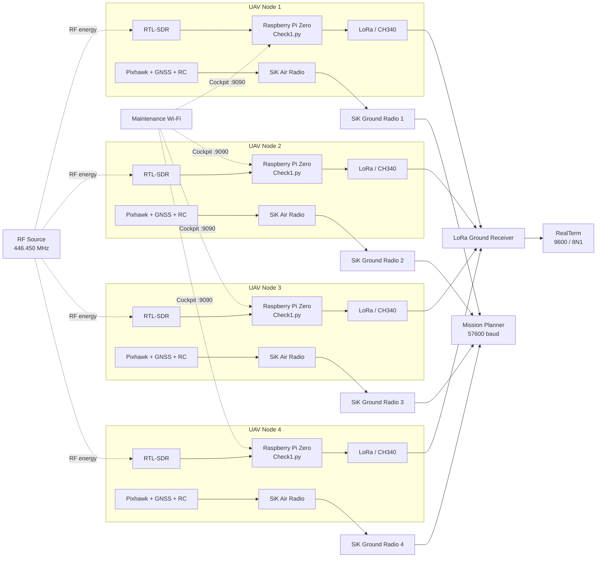

# Multi-UAV RF Source Localization and Telemetry System

[](https://www.tubitak.gov.tr/)
[](https://www.raspberrypi.com/)
[](https://www.python.org/)
[](#project-status)

A four-UAV experimental platform for **RF signal acquisition, RSSI-based telemetry, synchronized data transmission, remote node administration, and multi-vehicle flight monitoring**.

The repository was developed within the scope of the TÜBİTAK 3501 research project:

> **Yeni Bir Geometrik RSSI Yaklaşımıyla Çoklu İHA Kullanarak RF Kaynak Lokalizasyonu**  
> *RF Source Localization Using Multiple UAVs with a Novel Geometric RSSI Approach*

- **Program:** TÜBİTAK 3501 Career Development Program
- **Project No:** `123E294`
- **Host Institution:** Sivas University of Science and Technology
- **Principal Investigator:** Assist. Prof. Dr. Nurbanu Güzey
- **Contributor:** Muhammad Usman, Mehmet Yusuf Ocak

---

## Table of Contents

- [Project Objective](#project-objective)
- [Implemented Scope](#implemented-scope)
- [System Architecture](#system-architecture)
- [Hardware](#hardware)
- [Software Stack](#software-stack)
- [Core Node Configuration](#core-node-configuration)
- [Repository Structure](#repository-structure)
- [Quick Start](#quick-start)
- [Automatic Startup with systemd](#automatic-startup-with-systemd)
- [Remote Administration with Cockpit](#remote-administration-with-cockpit)
- [Ground-Station Operation](#ground-station-operation)
- [Multi-UAV Identification](#multi-uav-identification)
- [Verification](#verification)
- [Troubleshooting](#troubleshooting)
- [Measurement Limitations](#measurement-limitations)
- [Safety](#safety)
- [Project Status](#project-status)
- [References](#references)

---

## Project Objective

The project investigates RF source localization using signal-strength measurements collected by multiple UAVs.

Each UAV acts as an edge measurement node. Its Raspberry Pi:

1. acquires IQ samples from an RTL-SDR receiver,
2. calculates a filtered relative RSSI value,
3. schedules transmission in a node-specific TDMA slot,
4. sends a compact packet through a LoRa serial link, and
5. exposes system logs and hardware status through Cockpit.

In parallel, Pixhawk-based flight-control data are transported through independent SiK/MAVLink telemetry links to Mission Planner.

> [!IMPORTANT]
> This repository primarily implements the **airborne RF acquisition, synchronized telemetry, deployment, monitoring, and multi-vehicle integration infrastructure**.  
> A complete geometric localization solver, autonomous formation controller, and final target-position estimator must not be assumed to be finished unless those modules and their validation results are explicitly added to the repository.

---

## Implemented Scope

### Implemented and tested

- Four Raspberry Pi Zero edge nodes
- RTL2832U/R820T-based SDR acquisition
- Dynamic CH340 USB-to-serial port discovery
- LoRa serial transmission at `9600 baud`
- Compact packets in `N<node_id>,<rssi>` format
- Four-node TDMA scheduling
- Median filtering of repeated SDR measurements
- Automatic hardware reconnection
- Graceful shutdown and USB resource release
- `systemd` startup service
- USB hub recovery/rescan workflow
- Cockpit web-based administration
- RealTerm ground-station reception
- Pixhawk/ArduPilot vehicle configuration
- SiK/MAVLink telemetry at `57600 baud`
- Mission Planner multi-vehicle monitoring
- Unique node, MAVLink system, and telemetry-radio identification

### Project-level objective / continuing work

- Calibration of relative SDR output against known RF power
- Path-loss and distance-model identification
- Geometric multi-UAV RF source estimation
- Ground-station data fusion
- Localization-error analysis
- Flight validation under multipath and body-shadowing effects
- Autonomous search and formation behavior

---

## System Architecture



The architecture deliberately separates three communication paths:

| Path | Purpose | Typical interface |
|---|---|---|
| LoRa RSSI link | Relative RF measurement packets | RealTerm, `9600 / 8N1` |
| SiK/MAVLink link | Vehicle state, GNSS and flight control | Mission Planner, `57600 baud` |
| Maintenance Wi-Fi | Logs, service control and diagnostics | Cockpit, TCP `9090` |

---

## Hardware

Each airborne node uses the following core components:

- Raspberry Pi Zero
- Powered USB hub
- RTL2832U/R820T-based SDR receiver
- CH340 USB-to-serial adapter
- LoRa transceiver
- Pixhawk 2.4.8 flight controller
- GNSS module
- RC receiver
- SiK telemetry air module
- 4S LiPo battery and regulated power distribution
- Multirotor airframe

Ground-station components include:

- LoRa receiver connected through USB serial
- Four SiK telemetry ground modules
- Windows computer
- RealTerm
- Mission Planner
- Powered USB hub where required

---

## Software Stack

### Raspberry Pi

- Raspberry Pi OS, 64-bit
- Python 3
- NumPy
- PySerial
- pyrtlsdr
- rtl-sdr / librtlsdr
- libusb
- systemd
- Cockpit
- usbutils

### Ground station

- RealTerm
- Mission Planner
- ArduPilot / MAVLink
- Windows Device Manager for COM-port identification

### Validated Python package set

```text
numpy==2.4.4
packaging==26.2
pyserial==3.5
setuptools==69.5.1
wheel==0.47.0
pyrtlsdr==0.2.93
```

---

## Core Node Configuration

The deployed node script uses the following principal configuration:

```python
NODE_ID = 1
TOTAL_NODES = 4
SLOT_DURATION = 1.0
CYCLE_DURATION = TOTAL_NODES * SLOT_DURATION

LORA_BAUD = 9600
SDR_FREQ = 446.450e6
SDR_SAMPLE_RATE = 2.048e6
```

Only `NODE_ID` changes between aircraft:

| Aircraft | `NODE_ID` | Nominal transmission point |
|---|---:|---:|
| Drone 1 | 1 | cycle + 0.20 s |
| Drone 2 | 2 | cycle + 1.20 s |
| Drone 3 | 3 | cycle + 2.20 s |
| Drone 4 | 4 | cycle + 3.20 s |

### Packet format

```text
N<NODE_ID>,<RSSI>\n
```

Example:

```text
N1,-22
N2,-18
N3,-25
N4,-31
```

The integer payload reduces serial airtime and simplifies parsing at the ground station.

---

## Repository Structure

The repository contains the deployed node code, ground-station utilities, installation notes, logs, and earlier experimental scripts.

```text
tubitak35012026/
├── Check1.py                       # Deployed airborne acquisition and TDMA node
├── ground_station.py               # Ground-station processing / experimental receiver
├── requirements.txt                # Python dependencies
├── INSTALLATION_drone2.md          # Raspberry Pi deployment guide
├── UAV_Telemetry_Changelog.md      # Architecture and code-change history
├── send_signal.py                  # Serial/LoRa test utility
├── sendd_signal_deneme_2.py        # Earlier experimental node implementation
├── gs_data_*.log                   # Ground-station experiment logs
└── README.md
```

> [!NOTE]
> Experimental and legacy scripts are retained for traceability. `Check1.py` should be treated as the deployed node entry point unless a newer validated release is explicitly documented.

---

## Quick Start

### 1. Clone the repository

```bash
mkdir -p ~/Desktop
cd ~/Desktop
git clone https://github.com/YusufOck/tubitak35012026.git
cd tubitak35012026
```

### 2. Install system packages

```bash
sudo apt update
sudo apt upgrade -y

sudo apt install -y \
  git \
  python3 \
  python3-pip \
  python3-dev \
  build-essential \
  rtl-sdr \
  librtlsdr-dev \
  libusb-1.0-0-dev \
  cockpit \
  nano \
  wget \
  usbutils
```

### 3. Add the user to hardware-access groups

Replace `<user>` with `drone1`, `drone2`, `drone3`, or `drone4`.

```bash
sudo usermod -aG dialout,plugdev <user>
```

Log out and back in, or reboot, before relying on the new group membership.

### 4. Prevent the DVB driver from taking control of the RTL-SDR

```bash
sudo tee /etc/modprobe.d/blacklist-rtl-sdr.conf > /dev/null <<'EOF'
blacklist dvb_usb_rtl28xxu
blacklist rtl2832
blacklist rtl2830
EOF

sudo modprobe -r dvb_usb_rtl28xxu rtl2832 rtl2830 2>/dev/null || true
```

### 5. Install Python dependencies

```bash
python3 -m pip install \
  --break-system-packages \
  --ignore-installed \
  --no-cache-dir \
  numpy==2.4.4 \
  packaging==26.2 \
  pyserial==3.5 \
  setuptools==69.5.1 \
  wheel==0.47.0 \
  pyrtlsdr==0.2.93
```

### 6. Assign the node ID

```bash
nano ~/Desktop/tubitak35012026/Check1.py
```

Set exactly one identifier per aircraft:

```python
NODE_ID = 1  # Drone 1
NODE_ID = 2  # Drone 2
NODE_ID = 3  # Drone 3
NODE_ID = 4  # Drone 4
```

Two aircraft must never use the same `NODE_ID`; otherwise, they will be assigned the same TDMA slot.

### 7. Verify the USB devices

```bash
lsusb
python3 -m serial.tools.list_ports -v
```

Expected devices include:

```text
0bda:2838  Realtek RTL2838
1a86:7523  QinHeng CH340 serial converter
```

### 8. Verify the Python libraries

```bash
python3 - <<'PY'
import numpy
import serial
import serial.tools.list_ports
from rtlsdr import RtlSdr

print("Python libraries OK")
PY
```

### 9. Run the node manually

Stop the background service first so two processes do not compete for the same SDR and serial port:

```bash
sudo systemctl stop locnode.service 2>/dev/null || true
sudo pkill -f Check1.py 2>/dev/null || true

cd ~/Desktop/tubitak35012026
python3 Check1.py
```

Expected log sequence:

```text
LoRa connected on /dev/ttyUSB0
Found Rafael Micro R820T tuner
RTL-SDR connected and configured.
Localization Node 1 armed.
ABSOLUTE-TIME TDMA Started. Cycle: 4.0s
TX -> N1,-22
```

Use `Ctrl+C` to stop the manual test.

For the complete Raspberry Pi deployment procedure, see [`INSTALLATION_drone2.md`](INSTALLATION_drone2.md).

---

## Automatic Startup with systemd

Create the service:

```bash
sudo nano /etc/systemd/system/locnode.service
```

Example configuration for Drone 1:

```ini
[Unit]
Description=UAV Localization Telemetry Node - Drone1
After=multi-user.target
StartLimitIntervalSec=0

[Service]
Type=simple
User=root
WorkingDirectory=/home/drone1/Desktop/tubitak35012026
TimeoutStartSec=0

ExecStartPre=/bin/sleep 60
ExecStartPre=/usr/bin/udevadm settle --timeout=30
ExecStartPre=/usr/local/bin/usb_hub_rescan.sh

ExecStart=/usr/bin/python3 /home/drone1/Desktop/tubitak35012026/Check1.py

Restart=always
RestartSec=10
Environment=PYTHONUNBUFFERED=1
StandardOutput=journal
StandardError=journal

[Install]
WantedBy=multi-user.target
```

Update the username and working path for each aircraft.

Enable and start the service:

```bash
sudo systemctl daemon-reload
sudo systemctl enable locnode.service
sudo systemctl reset-failed locnode.service
sudo systemctl restart locnode.service
```

Inspect its state:

```bash
sudo systemctl status locnode.service --no-pager -l
sudo journalctl -u locnode.service -b -n 180 -l --no-pager
sudo journalctl -u locnode.service -f -o cat
```

---

## Remote Administration with Cockpit

Enable Cockpit:

```bash
sudo systemctl enable --now cockpit.socket
sudo systemctl status cockpit.socket --no-pager
```

Recommended node addresses:

| Node | Cockpit URL |
|---|---|
| Drone 1 | `https://drone1.local:9090` |
| Drone 2 | `https://drone2.local:9090` |
| Drone 3 | `https://drone3.local:9090` |
| Drone 4 | `https://drone4.local:9090` |

Useful operational commands:

```bash
hostname
hostname -I
lsusb
python3 -m serial.tools.list_ports -v
sudo systemctl status locnode.service --no-pager
sudo journalctl -u locnode.service -f -o cat
free -h
df -h
vcgencmd get_throttled 2>/dev/null || true
```

A second Cockpit terminal can be opened in another browser tab.

---

## Ground-Station Operation

### RealTerm: LoRa RSSI channel

Use RealTerm for the compact RSSI packets:

| Setting | Value |
|---|---|
| Port | COM port of the LoRa ground receiver |
| Baud | `9600` |
| Data bits | `8` |
| Parity | `None` |
| Stop bits | `1` |
| Flow control | `None` |
| Display | ASCII |

Expected stream:

```text
N1,-25
N2,-15
N3,-23
N4,-28
```

### Mission Planner: SiK/MAVLink channel

Use Mission Planner for Pixhawk telemetry:

| Setting | Value |
|---|---|
| Port | COM port of the related SiK ground radio |
| Baud | `57600` |
| Protocol | MAVLink |
| Vehicle type | Quad / X where applicable |

> [!WARNING]
> RealTerm at `9600` and Mission Planner at `57600` are not conflicting settings. They operate on two independent radios and two different data paths.

---

## Multi-UAV Identification

Three identifiers serve different purposes:

| Identifier | Layer | Requirement |
|---|---|---|
| `NODE_ID` | Python / LoRa TDMA | Unique value `1–4` |
| `SYSID_THISMAV` | MAVLink vehicle identity | Unique value `1–4` |
| SiK `Net ID` | Radio-pair isolation | Matching within a pair and unique across pairs |

### Mission Planner multi-vehicle workflow

1. Configure a unique `SYSID_THISMAV` on every Pixhawk.
2. Configure each SiK air/ground pair with a matching pair-specific Net ID.
3. Connect the first vehicle normally.
4. Right-click **CONNECT** to add the remaining COM ports.
5. Wait for parameter loading before adding the next vehicle.
6. Confirm that all vehicles appear separately in Mission Planner.

Maintain a written mapping such as:

| Drone | `NODE_ID` | `SYSID_THISMAV` | SiK Net ID | COM port |
|---|---:|---:|---:|---|
| Drone 1 | 1 | 1 | Record actual value | Record at test |
| Drone 2 | 2 | 2 | Record actual value | Record at test |
| Drone 3 | 3 | 3 | Record actual value | Record at test |
| Drone 4 | 4 | 4 | Record actual value | Record at test |

Do not guess or reuse unknown Net IDs. Read the local and remote radio settings, record them, and verify the complete pair before flight.

---

## Verification

### SDR test

Stop `locnode.service` before running a direct SDR test:

```bash
sudo systemctl stop locnode.service
sudo pkill -f Check1.py 2>/dev/null || true

rtl_test -t
timeout 300 rtl_test -s 2048000
```

A test with no continuing sample-loss or USB-disconnect messages indicates that the SDR data path is stable during the test interval.

### USB and serial verification

```bash
lsusb
ls -l /dev/ttyUSB* /dev/ttyACM* 2>/dev/null || true
python3 -m serial.tools.list_ports -v
```

### Kernel diagnostics

```bash
sudo dmesg -wH | egrep -i \
"usb|rtl|dvb|disconnect|reset|error|ch34|ttyUSB|under-voltage|voltage"
```

### Service verification

```bash
sudo systemctl status locnode.service --no-pager -l
sudo journalctl -u locnode.service -f -o cat
```

---

## Troubleshooting

| Symptom | Likely cause | Action |
|---|---|---|
| Only the Linux root hub appears in `lsusb` | External hub, OTG/data cable, port, or power failure | Fix the physical USB path before changing Python |
| CH340 is visible but `/dev/ttyUSB0` is missing | Device was re-enumerated | Run `python3 -m serial.tools.list_ports -v`; the port may be `/dev/ttyUSB1` |
| `LIBUSB_ERROR_NO_DEVICE` | SDR disconnected or USB bus reset | Inspect `dmesg`, power, hub, and cabling; restart after re-enumeration |
| `Could not open SDR` | Another process owns the SDR or the device disappeared | Stop manual `rtl_test`/Python processes and restart the service |
| `No LoRa port available` | CH340 is absent or inaccessible | Check `lsusb`, serial ports, permissions, and wiring |
| `TX -> N1,-22` appears but RealTerm is blank | Python wrote to UART, but RF reception is not proven | Verify LoRa wiring, mode pins, RF configuration, antennas, ground receiver, and COM port |
| Duplicate or irregular packets | Repeated `NODE_ID`, timing mismatch, or radio collision | Verify unique IDs and clock synchronization |
| Cockpit disconnects when the service starts | Power or USB instability may affect the Pi | Inspect undervoltage and USB reset logs; check the regulator under load |
| Service remains in `start-pre` | Startup delay or USB rescan is still running | Wait for the configured delay and inspect `journalctl` |
| `Permission denied` for `usb_hub_rescan.sh` | Script is not executable | Run `sudo chmod +x /usr/local/bin/usb_hub_rescan.sh` |

---

## Measurement Limitations

The current RSSI calculation is:

```python
power = np.mean(np.abs(samples) ** 2)
rssi = 10 * np.log10(power + 1e-12)
```

This result is a **relative SDR power index**, not automatically a calibrated absolute dBm measurement.

It does not currently compensate for:

- SDR-to-SDR gain differences
- antenna gain and orientation
- cable loss
- receiver impedance and calibration constants
- automatic-gain-control behavior
- body shadowing
- multipath fading
- near-field effects
- external RF interference

For defensible distance or source-power estimation:

1. calibrate every SDR against a known signal generator,
2. use a common gain policy,
3. characterize antenna and installation effects,
4. collect repeated measurements at known distances,
5. estimate the path-loss model,
6. report confidence intervals and localization error.

A changing value while the UAV is stationary is therefore not, by itself, proof of software failure.

---

## Safety

- Remove propellers during bench testing.
- Never perform motor tests with personnel or loose objects near the aircraft.
- Secure all USB, RF, power, and telemetry cables before flight.
- Use regulated power rails with adequate current margin.
- Verify battery voltage and cell balance before every test.
- Install antennas before transmitting.
- Do not power an RF transmitter without its antenna unless the manufacturer explicitly permits it.
- Confirm RC calibration, failsafe, frame type, compass, GNSS, motor order, and motor direction before flight.
- Treat this repository as research software; complete a controlled ground test before every airborne test.

---

## Project Status

**Current maturity:** integrated research prototype.

The edge acquisition and telemetry chain has been demonstrated with four node identifiers and simultaneous ground-station packet reception. The repository should not be presented as a completed production localization system until calibrated RF measurements, a validated source-position solver, flight-test datasets, error metrics, and repeatable acceptance tests are included.

### Recommended next milestones

- [ ] Move experimental scripts into a `legacy/` directory
- [ ] Add a single configuration file for per-drone parameters
- [ ] Add automated unit tests for TDMA and packet parsing
- [ ] Add structured ground-station logging
- [ ] Add NTP/clock-health checks before enabling TDMA
- [ ] Calibrate all RTL-SDR receivers
- [ ] Implement and validate the geometric localization solver
- [ ] Add flight-test datasets and localization-error plots
- [ ] Add CI checks and release tags
- [ ] Add an explicit software license

---

## Suggested Citation

```bibtex
@misc{ocak2026multiuavrf,
  title        = {Multi-UAV RF Source Localization and Telemetry System},
  author       = {Ocak, Mehmet Yusuf and Project 123E294 Team},
  year         = {2026},
  institution  = {Sivas University of Science and Technology},
  note         = {TÜBİTAK 3501 Research Project 123E294}
}
```

---

## References

- [TÜBİTAK](https://www.tubitak.gov.tr/)
- [Raspberry Pi Documentation](https://www.raspberrypi.com/documentation/)
- [Cockpit Project](https://cockpit-project.org/)
- [ArduPilot Documentation](https://ardupilot.org/)
- [Mission Planner: Connecting Multiple Vehicles](https://ardupilot.org/planner/docs/common-connect-mission-planner-autopilot.html)
- [ArduPilot Multi-Vehicle Flying](https://ardupilot.org/copter/docs/common-multi-vehicle-flying.html)
- [ArduPilot Radio Control Calibration](https://ardupilot.org/copter/docs/common-radio-control-calibration.html)
- [RealTerm](https://realterm.sourceforge.io/)
- [pyrtlsdr](https://pyrtlsdr.readthedocs.io/)

---

## Acknowledgement

This work was developed as part of TÜBİTAK 3501 Project `123E294`, conducted at Sivas University of Science and Technology under the supervision of Assist. Prof. Dr. Nurbanu Güzey.

The repository documents the engineering effort required to make a multi-UAV RF measurement platform reproducible, remotely manageable, and suitable for controlled localization research.

